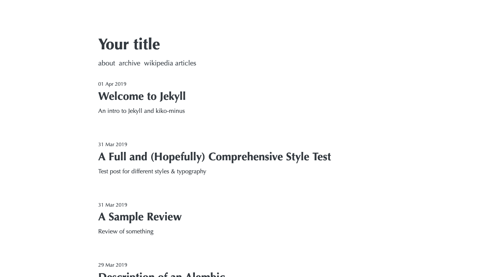

# kiko-minus

kiko-minus is a minimalistic Jekyll theme based on [kiko-plus](https://github.com/aweekj/Kiko-plus)

While the design and styles are largely inherited from the original theme, kiko-minus comes with many additional features including an emphasis on privacy and speed, automatically compressed images, gzip compression, and SEO optimization.



## Features
- Ready for use with GitLab or GitHub pages
- Syntax highlighting
- Automatic image compression
- Brotli, Zopfli, and Gzip compression
- Fully responsive
- Automatic pagination
- Automatic sitemap generation
- Automatic page generation based on tags & collections (in progress)
- Structured data (in progress)
- SEO support (in progress)
- LaTeX support (in progress)
- Comments with ISSO (in progress)
- Analytics with Fathom (in progress)
- No third party requests or cookies (unless using Fathom or ISSO)
- Automatic RSS feed (in progress)

## Installation

Add this line to your Jekyll site's `Gemfile`:

```ruby
gem "kiko-minus"
```

And add this line to your Jekyll site's `_config.yml`:

```yaml
theme: kiko-minus
```

And then execute:

    $ bundle

Or install it yourself as:

    $ gem install kiko-minus

## Usage

TODO: Write usage instructions here. Describe your available layouts, includes, sass and/or assets.

## Contributing

Bug reports and pull requests are welcome on GitLab at https://gitlab.com/areebk/kiko-minus/issues. This project is intended to be a safe, welcoming space for collaboration, and contributors are expected to adhere to the [Contributor Covenant](http://contributor-covenant.org) code of conduct.

## Development

To set up your environment to develop this theme, run `bundle install`.

Your theme is setup just like a normal Jekyll site! To test your theme, run `bundle exec jekyll serve` and open your browser at `http://localhost:4000`. This starts a Jekyll server using your theme. Add pages, documents, data, etc. like normal to test your theme's contents. As you make modifications to your theme and to your content, your site will regenerate and you should see the changes in the browser after a refresh, just like normal.

When your theme is released, only the files in `_layouts`, `_includes`, `_sass` and `assets` tracked with Git will be bundled.
To add a custom directory to your theme-gem, please edit the regexp in `kiko-minus.gemspec` accordingly.

## License

The theme is available as open source under the terms of the [MIT License](https://opensource.org/licenses/MIT).
